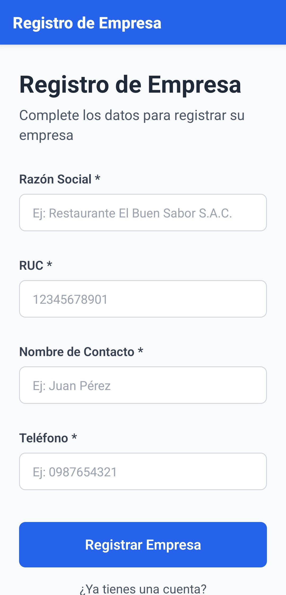
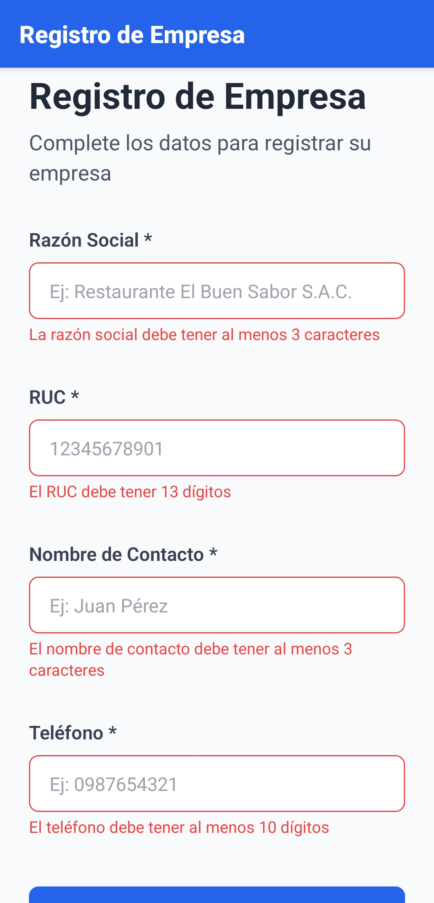
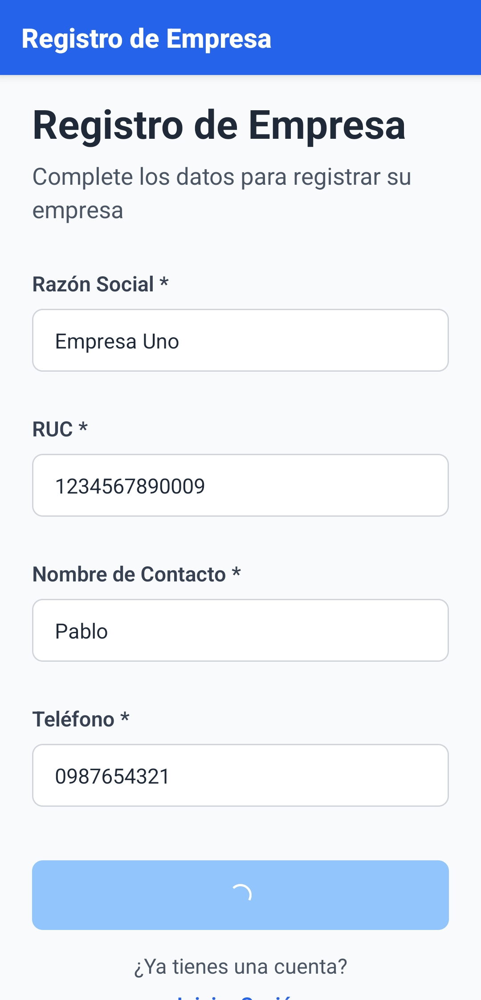
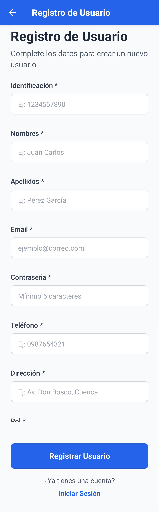
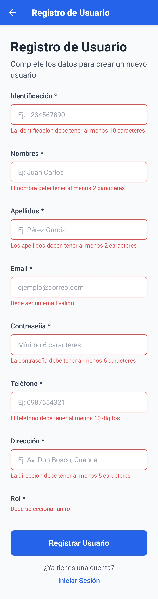
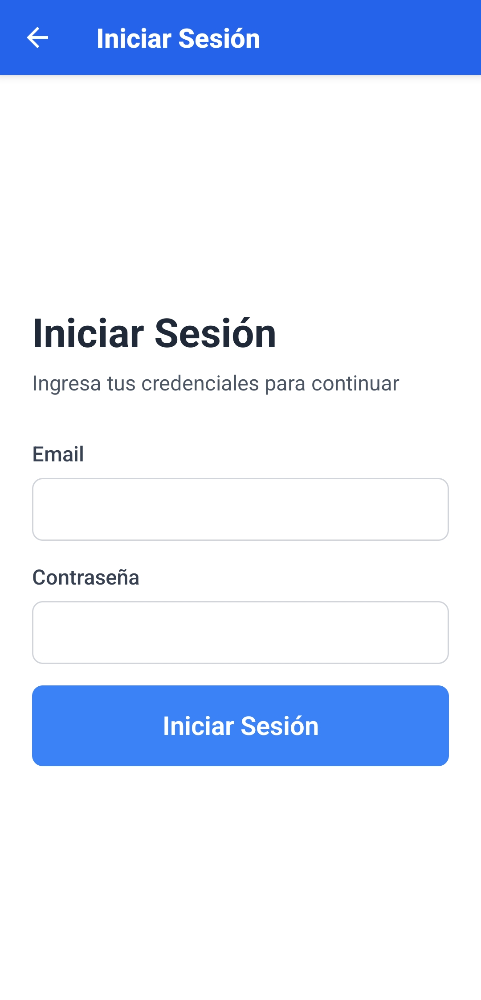

# Prueba de Conocimientos - Restaurante App

Aplicación móvil de punto de venta (POS) para restaurantes desarrollada con React Native como prueba técnica para el puesto de Junior React Developer.

## 📋 Tabla de Contenidos

- [Stack Tecnológico](#-stack-tecnológico)
- [Características Implementadas](#-características-implementadas)
- [Características Bloqueadas](#-características-bloqueadas)
- [Instalación y Configuración](#-instalación-y-configuración)

## 🛠 Stack Tecnológico

- **React Native**: 0.82.1 (CLI, sin Expo)
- **React**: 19.1.1
- **TypeScript**: 5.8.3
- **Styling**: NativeWind 2.0.11 (Tailwind CSS para React Native)
- **Navegación**: React Navigation (native-stack)
- **HTTP Client**: Axios
- **State Management**: Zustand
- **Form Management**: React Hook Form + Zod
- **Persistent Storage**: AsyncStorage
- **UI**: react-native-toast-message, react-native-vector-icons

## ✅ Características Implementadas

### 1. Registro de Empresa ✅ Completado y Funcional

- **Endpoint**: `POST /api/v1/empresa`
- **Estado**: ✅ **Funcionando correctamente**
- Formulario con validación usando React Hook Form + Zod
- Campos: Razón Social, RUC, Contacto, Teléfono
- Persistencia de datos en AsyncStorage usando Zustand
- Navegación automática a registro de usuario después de crear empresa
- Manejo de errores con Toast notifications

**Archivos relacionados**:

- `src/pantallas/RegistroEmpresa.tsx`
- `src/servicios/empresa.servicio.ts`
- `src/schemas/empresa.schema.ts`
- `src/tipos/empresa.ts`
- `src/stores/empresaStore.ts`

### 2. Pantalla de Login ✅ Completado (No probado)

- **Endpoint**: `POST /api/v1/auth`
- **Estado**: ⚠️ **Implementado pero no probado** (falta usuario para autenticar)
- Formulario de login con email y password
- Validación con Zod
- Almacenamiento de token JWT en AsyncStorage
- Interceptor de Axios configurado para incluir token en requests

**Archivos relacionados**:

- `src/pantallas/Login.tsx`
- `src/servicios/auth.servicio.ts`
- `src/schemas/auth.schema.ts`
- `src/tipos/auth.ts`
- `src/stores/authStore.ts`

### 3. Arquitectura y Configuración ✅ Completado

- ✅ Configuración de NativeWind con Tailwind CSS
- ✅ Babel configurado con plugin para Zod v4
- ✅ TypeScript configurado correctamente
- ✅ React Navigation con Stack Navigator
- ✅ Zustand stores con persistencia en AsyncStorage
- ✅ Axios client con interceptores para JWT

## ❌ Características Bloqueadas

### 4. Consulta de Roles Generales ❌ Bloqueado

- **Endpoint**: `GET /api/v1/roles`
- **Estado**: 🚫 **Bloqueado por autenticación**
- **Error**: `401 Unauthorized - "Token no proporcionado"`
- **Problema**: El endpoint requiere JWT token, pero no hay forma de obtener un token sin usuario existente

**Archivos relacionados**:

- `src/servicios/rol.servicio.ts`
- `src/tipos/rol.ts`

### 5. Creación de Usuario ❌ Bloqueado

- **Endpoint**: `POST /api/v1/usuarios`
- **Estado**: 🚫 **Bloqueado por autenticación**
- **Error**: `401 Unauthorized - "Token no proporcionado"`
- **Problema**:
  - El endpoint requiere JWT token
  - No se pueden obtener roles para el formulario (también requiere token)
  - Dependencia circular: necesito usuario para obtener token, pero necesito token para crear usuario

**Archivos relacionados**:

- `src/pantallas/RegistroUsuario.tsx` (Pantalla completa, no funcional)
- `src/servicios/usuario.servicio.ts`
- `src/schemas/usuario.schema.ts`
- `src/tipos/usuario.ts`

### 6. Características Opcionales ❌ No Iniciadas

Debido al bloqueo por autenticación, no se pudieron implementar:

- Creación de producto
- Creación de movimientos (ENTRADA)
- Creación de precios

## 🚀 Instalación y Configuración

### Requisitos Previos

- Node.js >= 20
- React Native CLI
- Android Studio (para Android)
- Xcode (para iOS, solo macOS)

### Instalación

```bash
# Instalar dependencias
npm install

# iOS: Instalar pods
cd ios
bundle install
bundle exec pod install
cd ..
```

### Ejecutar la aplicación

```bash
# Iniciar Metro Bundler
npm start

# Ejecutar en Android
npm run android

# Ejecutar en iOS
npm run ios
```

### Análisis del Swagger

Según la documentación de Swagger en `http://167.172.19.104:3003/api`:

- ✅ `POST /api/v1/empresa` - **SIN autenticación** (funciona)
- ❌ `GET /api/v1/roles` - **CON autenticación**: `"security":[{"bearer":[]}]`
- ❌ `POST /api/v1/usuarios` - **CON autenticación**: `"security":[{"bearer":[]}]`

No se encontraron:

- Credenciales de usuario de prueba
- Endpoint de seed/init
- Usuario por defecto en documentación

### Soluciones Intentadas

1. ✅ Buscar credenciales en documentación Swagger
2. ✅ Intentar usuarios comunes (admin@admin.com, test@test.com)
3. ✅ Buscar endpoint de seed o inicialización
4. ✅ Verificar configuración de axios e interceptores
5. ✅ Consultar con el proveedor de la prueba técnica

## 📸 Capturas de Pantalla

### Pantalla de Registro de Empresa




### Validación de Formularios


### Toast Notifications


### Pantalla de Registro de Usuario


### Pantalla de Login


---

## 👨‍💻 Desarrollador

**Pablo Astudillo**

---

**Estado del proyecto**: ⏸️ En espera de solución al problema de autenticación de la API
